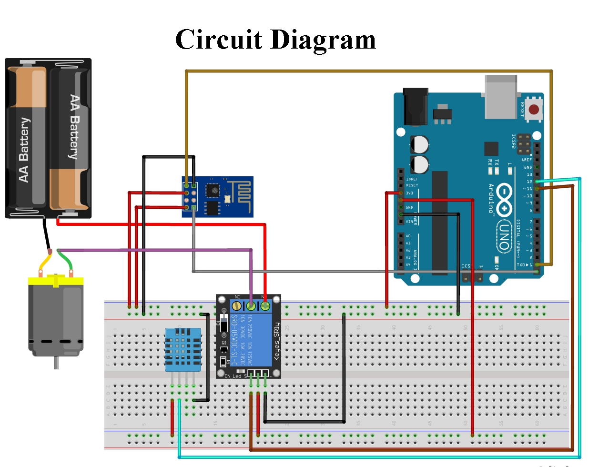
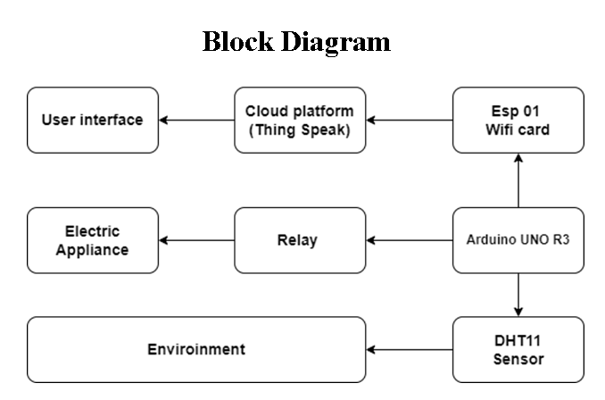
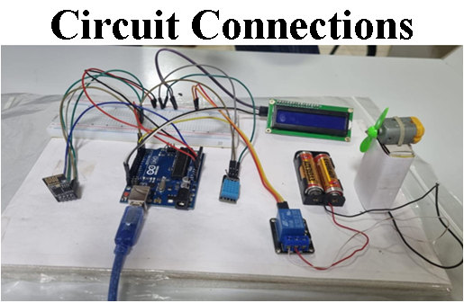
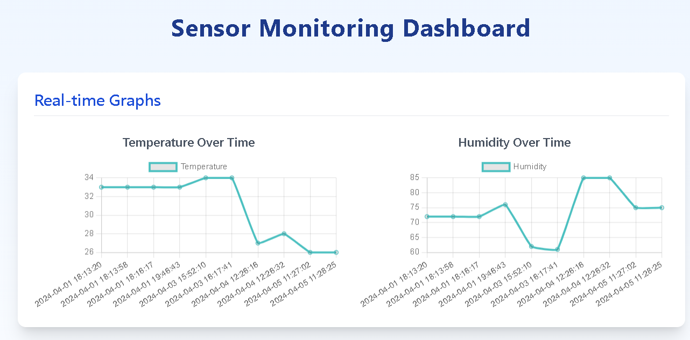
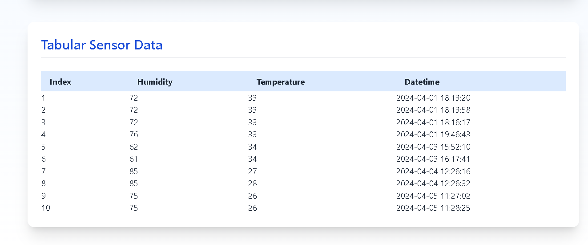

# IoT-Based Climate Control System

This project is an IoT-based climate control system that monitors temperature and humidity using a DHT11 sensor. The data is collected by an Arduino Uno R3 and sent to a PHP server via an ESP8266-01 WiFi module. The data is then stored in a MySQL database and visualized using a web interface.

## Project Overview

- **Sensor**: DHT11 (Temperature and Humidity Sensor)
- **Microcontroller**: Arduino Uno R3
- **WiFi Module**: ESP8266-01
- **Server**: PHP server (XAMPP)
- **Database**: MariaDB (XAMPP)
- **Web Interface**: HTML, JavaScript, Tailwind, DataTables

## Project Components

- **Arduino Sketch (`.ino` file)**: Contains the code to read data from the DHT11 sensor and send it to the server.
- **PHP Server Files**:
  - `dbconn.php`: Establishes a connection to the MySQL database.
  - `receiver.php`: Receives data from the Arduino and stores it in the database.
  - `sender.php`: Retrieves data from the database for display.
  - `index.php`: Displays the data in a table and graph using DataTables and Bootstrap.

## Circuit Diagram

## Circuit Connection

| Arduino Uno R3 | ESP8266 - 01 |
| -------------: | :----------- |
| RX (Pin 2)     | TX           |
| TX (Pin 3)     | RX           |
| GND            | GND          |
| 3.3v           | VCC          |
| 3.3v           | CHPD         |
| None           | GPIO1        |
| None           | GPIO2        |
| None           | Reset        |

| Arduino Uno R3 | DHT 11 Sensor |
| -------------: | :------------ |
| 5v             | VCC           |
| GND            | GND           |
| 2 (Data Pin)   | Data          |

| Arduino Uno R3 | I2C LCD Display |
| -------------- | --------------- |
| GND            | GND             |
| 5v             | VCC             |
| A4             | SDA             |
| A5             | SLC             |

| Arduino Uno R3 | SRD-05VDC-SL-C Relay |
| -------------: | :------------------- |
| 5v             | VCC                  |
| GND            | GND                  |
| 5 (Data Pin)   | Signal               |

| SRD-05VDC-SL-C Relay | Appliance     |
| -------------------: | :------------ |
| NO                   | Power +ve     |
| CC                   | Appliance +ve |

## Block Diagram

## Project Photo

## Video Presentation

[Watch the Idea pitch presentation video](assets/Smart%20Climate%20Control%20System.mp4)

## Prerequisites

- **Arduino IDE**: To upload the sketch to the Arduino Uno.
- **XAMPP**: To run the PHP server and MySQL database locally.
- **ESP8266 Libraries**: Required for Arduino to communicate with the ESP8266-01 WiFi module.

## Setup Instructions

1. **Arduino Setup**:
   - Upload the `.ino` file to the Arduino Uno.
   - Connect the DHT11 sensor to the Arduino Uno as per the circuit connections.
   - Connect the ESP8266-01 to the Arduino Uno as per the circuit connections.

2. **Server Setup**:
   - Install XAMPP and start Apache and MySQL services.
   - Place the `ClimateControl` folder in the `htdocs` directory of XAMPP.
   - Import the provided SQL file into your MySQL database.
   - Update the `dbconn.php` file with your database credentials.

3. **Running the Project**:
   - Power the Arduino Uno and the ESP8266-01 will start sending data to the PHP server.
   - Open `index.php` in your web browser to view the data in real-time.

## Libraries and Dependencies

- **Arduino Libraries**:
  - `DHT.h`: For reading data from the DHT11 sensor.
  - `ESP8266WiFi.h` [by ]: For enabling WiFi communication.
  
- **Web Libraries**:
  - [DataTables](https://cdn.datatables.net)
  - [Tailwindcss](https://tailwindcss.com)

## Screenshots

### Graphical view

### Tabular view

## Contributors

- [Barath K V](https://github.com/BarathKV)
- [Lalith Abhishek G](https://github.com/LalithAbhishekG)
